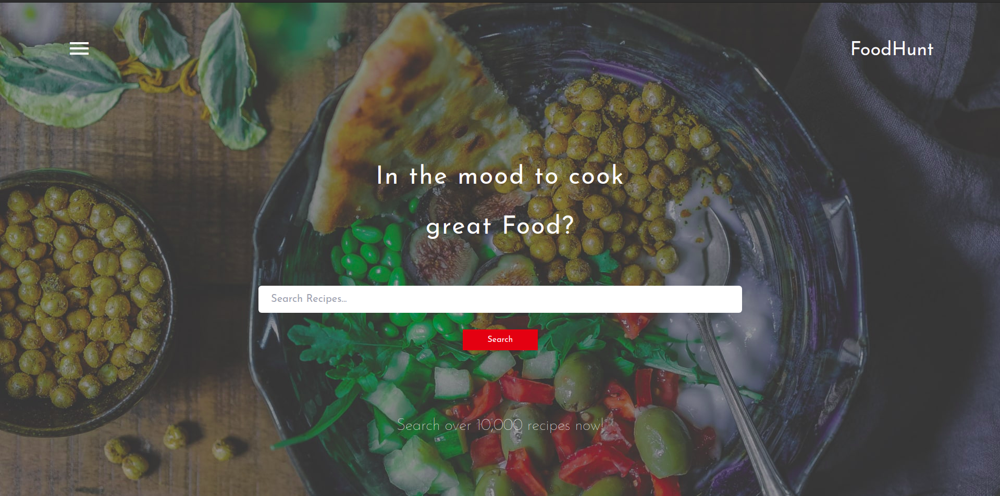
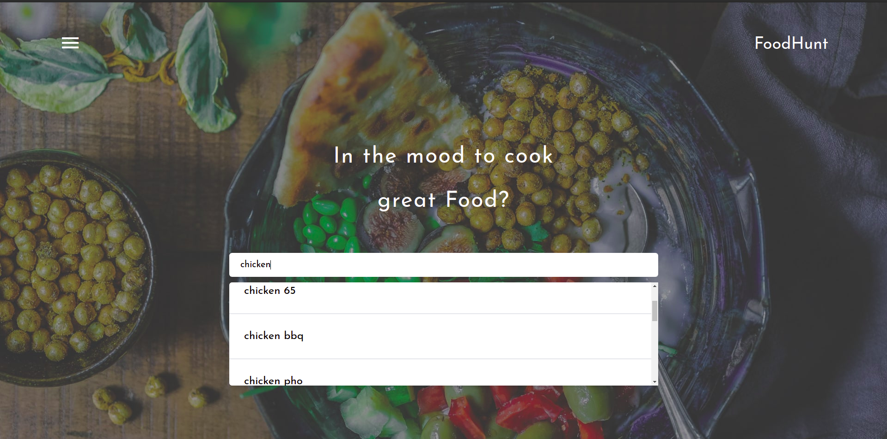
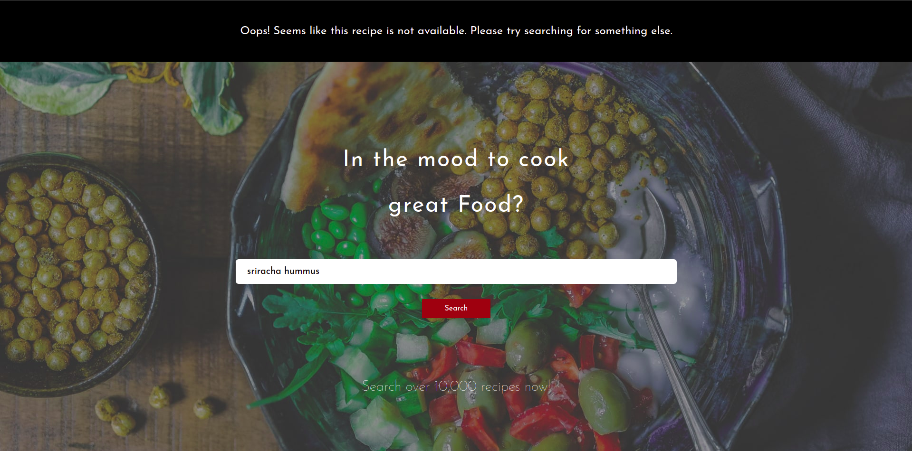
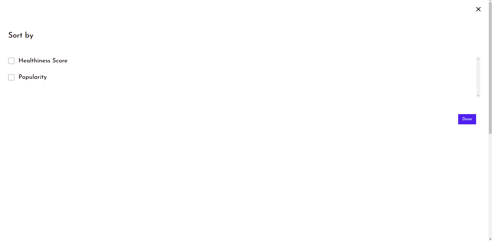
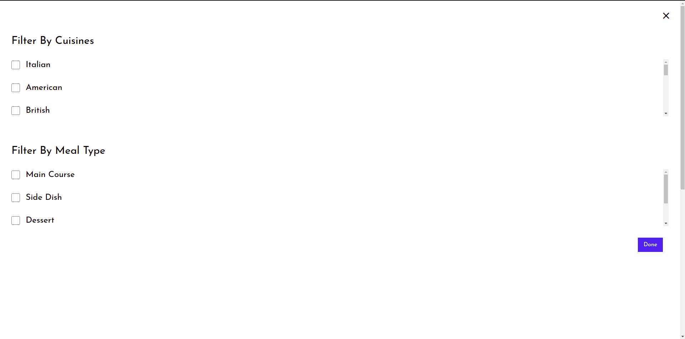
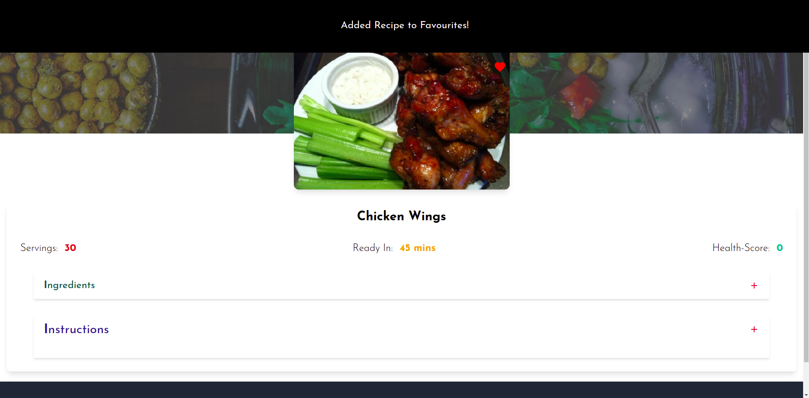

Live Site : [FoodHunt](https://food-hunt.netlify.app)

# FoodHunt

FoodHunt is a web app where users can search for recipes and save their favourite ones for later.

### `Technologies used`

The web app was created from scratch using :

1. **Reactjs** and the built in **Context-api** (used for better state management).
2. **Tail Wind CSS** to style the web app.
3. The food api from [Spoonacular](https://spoonacular.com/food-api). The api functions are well documented on their site and they also have a free plan.
4. **Figma** to create the designs. A mockup of all the relevant screen sizes eg. mobile, desktop, tablet etc . were created. The images were downloaded from [Unsplash](https://unsplash.com)

### `Features`

1. ##### Auto-suggest Drop Down Menu

Upon entering letters into the search bar the spoonacular api sends back a json response containing the auto-suggested recipes array. The task is to then map over the array, populating the drop-down menu. The value of the search bar changes to one of the suggested recipes when clicked.
The auto-suggest menu closes when the user clicks outside the search bar.

2. ##### Alerts

If the recipe does not exist then an alert shows up on the top. _P.s_. If any error occurs while making the fetch request, the error message will be shown in the form of an alert.

3. ##### Sort

In the recipes page, by clicking the sort arrow, the sort panel opens. Here, the user can choose between _Healthiness score_ and _Popularity_. The recipes will be sorted upon clicking the done button.

4. ##### Filter

The filter panel opens by clicking the filter arrow and here the user can filter the recipes by country and/or by meal types.The recipes will be filtered upon clicking the done button.

P.s.The user can select both sort and filter to further narrow down the search.

5. ##### Add to Favourites

By clicking the heart icon on the top-right side of the image the user can save the recipe to the favourites page, where it can be accessed later. P.s. An alert pops up letting the user know the recipe has been favourited, the heart icon also turns red. Clicking the heart icon again removes the recipe from favourites and an alert shows up to confirm that.

### `Installation`

Clone the project from GitHub and open the terminal, making sure you are in the folder where the project is saved. Type in : ` npm install`. That will install all the dependencies. Then type in : `npm run start`
That should open up the react project on
`localhost:3000`.

### `After-Thoughts`

To save the recipes in the favourites page the `localStorage` api was used. In the upcoming versions, the plan is to make this a fullstack web app by adding a database so that users can have their individual profiles where they can save recipes, mark them as favourites etc. There is also a plan to add a feature where users can share their opinion in regards to a particular recipe.
